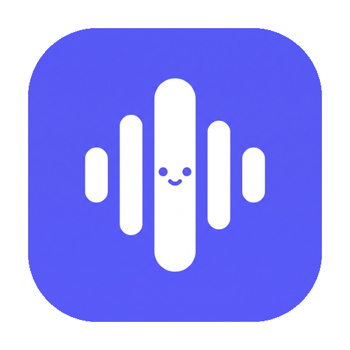

<p align="center">
  
</p>

<h1 align="center">Meeterz</h1>

<p align="center">
  A private, local-first meeting recorder and transcriber for Apple silicon Macs.
</p>

<p align="center">
  <a href="https://meeterz-landing.vercel.app">Website</a> ·
  <a href="https://github.com/Bilal-Bjo/Meeterz/releases">Download</a>
</p>


## What it does

- Records system audio and microphone input as separate channels.
- Transcribes locally with Whisper, including mixed-language meetings.
- Keeps searchable transcripts, rich notes, folders and audio on your Mac.
- Generates optional meeting summaries with your own OpenAI API key.
- Imports Teams `.vtt` transcripts and exports Markdown or PDF.
- Supports speaker labels, click-to-seek playback and on-device diarization.

Meeterz has no account, cloud workspace or automatic upload. Meeting data lives in
`~/Library/Application Support/meeterz`.

## Install

Download the latest Apple silicon build from [GitHub Releases](https://github.com/Bilal-Bjo/Meeterz/releases).

1. Install Whisper: `brew install whisper-cpp`
2. Drag Meeterz from the DMG into Applications.
3. Because the current build is not notarized, right-click Meeterz and choose **Open** on first launch.
4. Grant Microphone and System Audio Recording access when macOS prompts.

Requires macOS 14.4 or later.

## Development

```sh
brew install whisper-cpp
npm install
npm run dev
```

Useful commands:

```sh
npm run lint
npm run typecheck
npm run build
npm run test:e2e
npm run build:mac
```

The packaged app includes its default Whisper, VAD and diarization models. Local model binaries,
build output and test artifacts are intentionally excluded from Git.

## License

[MIT](LICENSE)
