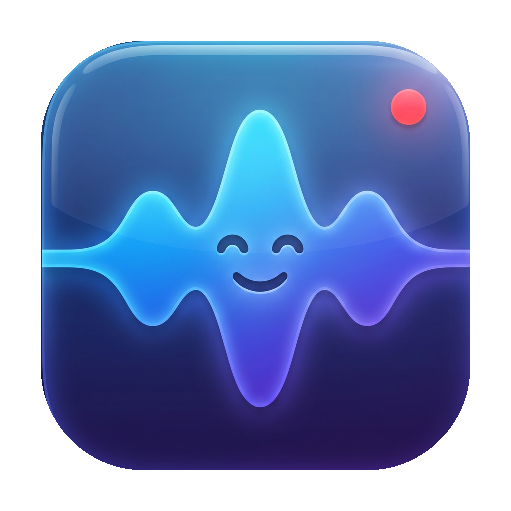
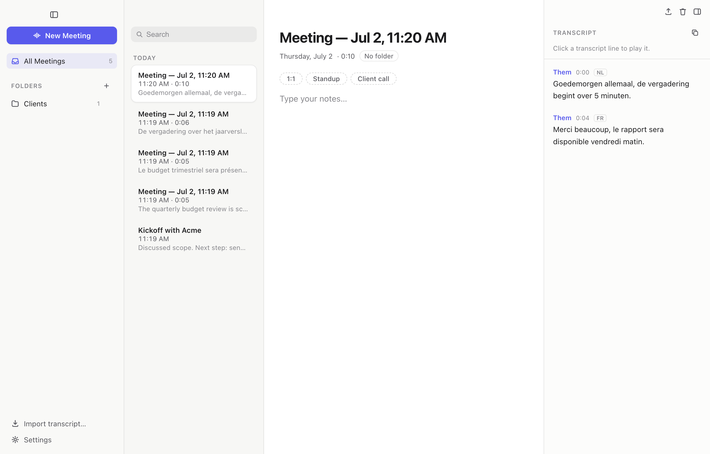
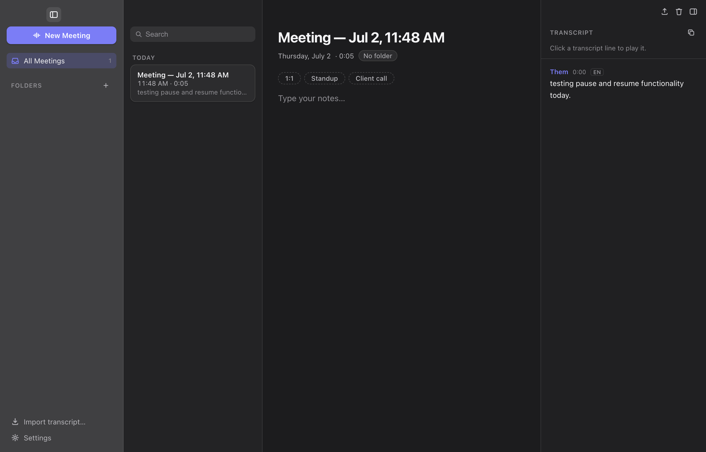

<p align="center">
  
</p>

<h1 align="center">Meeterz</h1>

<p align="center">
  <strong>Local-first meeting recorder &amp; transcriber for macOS.</strong><br />
  Records Teams calls and in-room conversations, transcribes on-device — even when the
  meeting switches languages mid-sentence. Nothing ever leaves your Mac.
</p>

---

## Why Meeterz

- **No bots, no cloud.** Captures **system audio** (Teams, Meet, anything) via macOS's
  CoreAudio tap — no virtual audio drivers — plus the **microphone** for the room, as two
  separate channels. Transcription runs locally with Whisper (Metal-accelerated).
- **Built for multilingual meetings.** Language is auto-detected every ~30 seconds, so a
  meeting that drifts between Dutch, French and English is transcribed correctly, with a
  language tag per segment.
- **Notes-first.** Type during the meeting; the transcript builds itself alongside.

<p align="center">
  
</p>

## Features

- 🎙️ Dual-channel capture — Teams/system audio + room mic, driver-free (Electron 39 CoreAudio tap)
- 🌍 Mixed-language transcription (NL/FR/EN + 90 more, auto-detected per window)
- ⚡ Live transcript while recording (~15 s behind), pause/resume, silence & muted-mic hints
- 🗣️ Speaker labels: Them / You per channel, plus on-device diarization (pyannote) within a channel
- 🔇 Voice-activity detection — keyboard noise, coughs and silence never reach the transcript
- 📥 Import Microsoft Teams `.vtt` transcripts with speaker names
- 🔎 Full-text search across all meetings (SQLite FTS5) + find-in-transcript with ⌘F
- ▶️ Click any transcript line to play that exact moment
- 📝 Rich notes (headings, checklists) with meeting templates
- 📤 Export to Markdown / PDF, copy as Markdown
- 🗂 Folders with drag-and-drop; Recently Deleted with 30-day retention and restore
- 🌙 Light / dark / system theme; collapsible panels; crash-safe recordings
- 📎 Menu-bar quick record + global shortcut ⌥⌘R
- 💾 Audio archived as AAC (~15 MB/hour); in-app Whisper model manager

<p align="center">
  
</p>

## Install

**[Download the latest release](https://github.com/Bilal-Bjo/Meeterz/releases)** (Apple Silicon).

1. Install whisper.cpp: `brew install whisper-cpp`
2. Open the DMG and drag **Meeterz** to Applications.
3. The build is not notarized yet — on first launch, right-click the app → **Open**
   (or `xattr -dr com.apple.quarantine /Applications/Meeterz.app`).
4. First recording prompts for **System Audio Recording** and **Microphone** permissions.

Requires macOS 14.4+ on Apple Silicon. Whisper models (multilingual `small` by default) and
the VAD model ship inside the app; other models can be downloaded from Settings.

## How it works

| Stage | Implementation |
|---|---|
| System audio | Electron 39 `getDisplayMedia` loopback → Apple CoreAudio process tap (audio-only grant; no Screen Recording permission) |
| Microphone | `getUserMedia` with echo cancellation, so the mic channel stays clean of speaker bleed |
| Capture | Both channels streamed as 16 kHz PCM to the main process, written as separate WAVs (crash-recoverable headers) |
| Transcription | `whisper-cli` per ~30 s window with per-window language auto-detection; Silero VAD pre-filter; hallucination-loop cleanup |
| Diarization | sherpa-onnx (pyannote segmentation + TitaNet embeddings), per channel, fully optional |
| Storage | SQLite (FTS5 search index) + AAC audio in `~/Library/Application Support/meeterz` |

## Develop

```sh
brew install whisper-cpp
npm install
curl -L -o models/ggml-small.bin https://huggingface.co/ggerganov/whisper.cpp/resolve/main/ggml-small.bin
curl -L -o models/ggml-silero-v5.1.2.bin https://huggingface.co/ggml-org/whisper-vad/resolve/main/ggml-silero-v5.1.2.bin
npm run dev
```

End-to-end tests (Playwright drives the real app: records macOS `say` output through the
loopback and asserts the Whisper transcript in English, French, Dutch and a mixed NL→FR
recording — plus import, search, trash, themes and layout):

```sh
npm run build && npm run test:e2e
```

Package a DMG: `npm run build:mac`

## License

[MIT](LICENSE)
